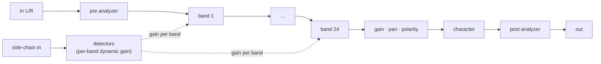

# Noob-Q

> **About Noob-Q.** I wrote Noob-Q as a humorous, affectionate spoof of
> FabFilter's Pro-Q, whose feature set and look inspired it. It is a free
> plug-in from Noob Audio Engineering, built to show what
> noob-vst-webgui-framework can do with a product-sized interface. It is my
> tribute to work I admire, not a parity replacement for the original.

A free Pro-Q style 24-band parametric EQ by Noob Audio Engineering, built on
[noob-vst-webgui-framework](https://github.com/Noob-Audio-Engineering/noob-vst-webgui-framework). The plug-in window is the operating
system's web view; what it shows is a Vue 3 + Tailwind single-page app served
by the plug-in itself and driven over noob-vst-webgui-framework's local WebSocket bridge. The
DSP, the parameters and the page are all in this crate; everything reusable
is in the framework.

| Part | Where | Role |
|---|---|---|
| DSP | `src/dsp/` | Filters, dynamics, linear-phase convolver, analyzer, engine, demo sources, and the parameter / stream layout. Host-agnostic. |
| Plug-in | `src/plugin.rs` (feature `plugin`) | nih-plug VST3 / CLAP effect with a stereo side-chain input. Embeds `web/dist`. |
| Standalone | `src/bin/standalone.rs` | Fake audio thread on demo signals plus the noob-vst-webgui-framework server: UI development and benchmarking without a DAW. |
| SPA | `web/` | The interface. See [`web/README.md`](web/README.md). |

Feature coverage against the Pro-Q 4 manual is tracked in
[`docs/FEATURES.md`](docs/FEATURES.md) (inventory in
[`docs/PROQ4-FEATURES.md`](docs/PROQ4-FEATURES.md)). The wire format and the
other guides live in the framework's
[`docs/`](https://github.com/Noob-Audio-Engineering/noob-vst-webgui-framework/tree/main/docs).

## Install it

Every commit on `main` is built for Windows and macOS and published to the
rolling [`latest`](https://github.com/Noob-Audio-Engineering/noob-q/releases/tag/latest)
release: a VST3 and a CLAP in one zip, with a checksummed manifest beside them
and a photograph of that build running.

The easy way is the [Noob Plugin
Manager](https://github.com/Noob-Audio-Engineering/noob-plugin-manager), which
installs and updates every plug-in in this organisation and verifies the
checksum before it writes anything. Or take the zip and unpack it into your
plug-in folders yourself.

## Build and run

```sh
# 1. The page (once, and after every UI change)
cd web && npm install && npm run build && cd ..

# 2. Standalone: serves web/dist on http://127.0.0.1:4242/ (or the next free port)
cargo run --features plugin --bin noob-q-standalone --release -- --open

# 3. Tests (DSP: filters, dynamics, convolver, analyzer, engine)
cargo test

# 4. The plug-in (needs web/dist; pulls nih-plug)
cargo build --features plugin --release
```

Step 4 produces the plug-in library (`target/release/noob_q.dll`, `.so` or
`.dylib`) which needs to be placed in a `.vst3` / `.clap` bundle (see *Bundling*
below). Without the `plugin`
feature the crate is only the DSP and the standalone, so `cargo test` and
`cargo run` need neither nih-plug nor a built page.

Standalone options: `--port N` insists on a port (the default probes upward
from 4242), `--open` launches the browser, `--dir path` serves other assets,
`RUST_LOG=debug` logs every edit from the page. While the page is being
developed, `NOOB_VST_WEBGUI_FRAMEWORK_PORT=4242 npm run dev` in `web/` gives hot reload with
`/ws`, `/instance` and `/instances` proxied to the running standalone.

Tools that work against a running instance, from a checkout of the
[framework repository](https://github.com/Noob-Audio-Engineering/noob-vst-webgui-framework):

```sh
node tools/bench.mjs 4242            # edit→echo and ping latency, stream rates
node tools/setparam.mjs 4242 b1_gain 0.75
node tools/instances.mjs             # every bridge server on this machine
```

### Bundling

The plug-in library (`target/release/noob_q.dll`, `.so` or `.dylib`) goes into
a bundle folder; I do it by hand on Windows:

```
noob-q.vst3/Contents/x86_64-win/noob-q.vst3        the .dll, renamed
noob-q.vst3/Contents/x86_64-linux/noob-q.so        Linux
noob-q.vst3/Contents/MacOS/noob-q                  macOS, plus an Info.plist
```

Copy the folder to the system VST3 directory (`C:\Program Files\Common Files\VST3`,
`~/.vst3`, `~/Library/Audio/Plug-Ins/VST3`). For CLAP, the same library renamed
to `noob-q.clap` in the CLAP directory. nih-plug's bundler does this with the
metadata filled in: `cargo install --git https://github.com/robbert-vdh/nih-plug.git cargo-nih-plug`,
then `cargo nih-plug bundle noob-q --release --features plugin`.

### Local framework development

To work on [noob-vst-webgui-framework](https://github.com/Noob-Audio-Engineering/noob-vst-webgui-framework) and this plug-in together, point
both dependencies at a checkout next to this repository:

```toml
# Cargo.toml, while developing (do not commit)
[patch."https://github.com/Noob-Audio-Engineering/noob-vst-webgui-framework"]
noob-vst-webgui-framework = { path = "../noob-vst-webgui-framework/crates/noob-vst-webgui-framework" }
noob-vst-webgui-framework-nih = { path = "../noob-vst-webgui-framework/crates/noob-vst-webgui-framework-nih" }
```

```sh
# the browser package: link the checkout's root package into web/
cd ../noob-vst-webgui-framework && npm link
cd ../noob-q/web && npm link @noob-audio-engineering/noob-vst-webgui-framework
```

The Vite config keeps the package out of the dependency pre-bundle, so a
linked checkout hot-reloads. Host-driven window resizing needs the patched
nih-plug this repository's `[patch]` section points at; keep that line.

## Parameters

Ids are what the page, the standalone and the plug-in all use; the host
sees the display names. All values are plain (Hz, dB, %, ms, indices);
noob-vst-webgui-framework carries them normalized 0..1 on the wire with the mapping in the
manifest.

### Global (`global` group)

| id | type | range / labels | default | notes |
|---|---|---|---|---|
| `bypass` | toggle | | off | Linear phase keeps its latency while bypassed. |
| `output_gain` | float | −60 … +36 dB | 0 | After the EQ, before Character. |
| `gain_scale` | float | 0 … 200 % | 100 | Scales every band's static gain. |
| `auto_gain` | toggle | | off | Compensates the mean static gain over 20 Hz – 20 kHz. |
| `output_pan` | float | −100 … 100 % | 0 | Constant-power pan. |
| `pan_mode` | enum | L/R, M/S | L/R | Pan between left/right or mid/side. |
| `phase_invert` | toggle | | off | Output polarity. |
| `processing_mode` | enum | Zero Latency, Natural Phase, Linear Phase | Zero Latency | Natural Phase is approximated by the IIR path. |
| `lp_quality` | enum | Low, Medium, High, Very High, Maximum | High | FIR length 4096 … 65536; the top two disable dynamic EQ. |
| `character` | enum | Clean, Subtle, Warm | Clean | Saturation after the output gain. |
| `gain_q` | toggle | | off | A Bell narrows as its gain grows. |

### Analyzer and display (non-automatable)

| id | type | range / labels | default | read by |
|---|---|---|---|---|
| `analyzer_pre` | toggle | | on | DSP: compute the input spectrum |
| `analyzer_post` | toggle | | on | DSP: compute the output spectrum |
| `analyzer_sc` | toggle | | off | DSP: compute the side-chain spectrum |
| `analyzer_resolution` | enum | Low, Medium, High, Maximum | Medium | DSP: FFT 1024 / 2048 / 4096 / 8192 |
| `analyzer_range` | enum | 60, 90, 120 dB | 90 dB | page only |
| `analyzer_speed` | enum | Very Slow … Very Fast | Medium | page only |
| `analyzer_tilt` | enum | 0 … 6 dB/oct | 4.5 dB/oct | page only |
| `analyzer_freeze` | toggle | | off | page only |
| `display_range` | enum | 3, 6, 12, 30 dB | 12 dB | page only |
| `piano_display` | toggle | | off | page only |

"Page only" parameters exist so the settings persist with the plug-in state;
the analyzer's range, averaging, tilt and freeze are applied in the browser on
the raw dB bins.

### Bands (`b1_*` … `b24_*`, groups `Band 1` … `Band 24`)

| id | type | range / labels | default | notes |
|---|---|---|---|---|
| `b<n>_on` | toggle | | off | |
| `b<n>_shape` | enum | Bell, Low Shelf, Low Cut, High Shelf, High Cut, Notch, Band Pass, Tilt Shelf, Flat Tilt, All Pass | Bell | |
| `b<n>_freq` | float, log | 10 Hz … 30 kHz | spread 30 Hz … 16 kHz per band | |
| `b<n>_gain` | float | ±30 dB | 0 | Bells, shelves, tilts only. |
| `b<n>_q` | float, log | 0.025 … 40 | 1 | For cuts: shapes the knee. |
| `b<n>_slope` | enum | 6, 12, 18, 24, 30, 36, 48, 72, 96 dB/oct, Brickwall | 12 dB | Cuts, shelves, tilt shelf. |
| `b<n>_place` | enum | Stereo, Left, Right, Mid, Side | Stereo | |
| `b<n>_solo` | toggle | | off | Non-automatable. Hear the band's region. |
| `b<n>_dyn_on` | toggle | | off | |
| `b<n>_dyn_range` | float | ±30 dB, signed | 0 | Negative cuts when loud, positive boosts. |
| `b<n>_dyn_thr` | float | −60 … 0 dBFS | −24 | Ignored with auto threshold. |
| `b<n>_dyn_auto` | toggle | | on | Threshold follows the region's average level. |
| `b<n>_dyn_attack` | float, log | 0.1 … 500 ms | 10 | |
| `b<n>_dyn_release` | float, log | 1 … 2000 ms | 120 | |
| `b<n>_dyn_sc` | toggle | | off | Detect on the external side-chain. |

### Demo sources (standalone only, `source` group, non-automatable)

| id | type | range / labels | default |
|---|---|---|---|
| `src_kind` | enum | Pink Noise, White Noise, Saw, Sine, Drum Loop, Silence | Pink Noise |
| `src_freq` | float, log | 20 Hz … 20 kHz | 220 |
| `src_level` | float | 0 … 1 | 0.5 |
| `sc_kind` | enum | same as `src_kind` | Drum Loop |
| `sc_level` | float | 0 … 1 | 0.5 |

The manifest meta tells the page which world it is in: `standalone: true`
here, `false` in the plug-in, plus `vendor`, `version`, `sample_rate`,
`bands`, `freq_range` and `gain_range`.

## Streams

| id | kind | capacity | rate | contents |
|---|---|---|---|---|
| `spectrum_pre` | spectrum | 4097 | every 2nd block | input magnitude, dBFS per bin (0 dB = full-scale sine) |
| `spectrum_post` | spectrum | 4097 | every 2nd block | output magnitude, dBFS per bin |
| `spectrum_sc` | spectrum | 4097 | every 2nd block, when a side-chain exists | side-chain magnitude, dBFS per bin |
| `meter_in` | meter, 2 ch | 4 | every block | `[peak L, peak R, rms L, rms R]`, linear |
| `meter_out` | meter, 2 ch | 4 | every block | same, after the output stage |
| `curve` | curve, sticky | 256 | on change | static response in dB, log-spaced 10 Hz … 30 kHz, auto gain included |
| `band_dyn` | raw | 24 | every block | dynamic gain per band, dB |
| `band_level` | raw | 24 | every 4th block | detector level per band, dBFS (−120 when off) |

A spectrum frame is as long as the current FFT needs (`fft / 2 + 1` bins);
the page places bins with the sample rate from the stream meta. `curve` is
sticky, so a window that opens later gets the response immediately. At
48 kHz / 256 samples that is about 190 meter frames and 94 spectrum frames
per second per spectrum; a page can throttle or disable any stream it is not
showing.

Messages (`client.send(topic, data)` / `{"t":"msg"}` frames): the page sends
`reset` (restore every default) and, in a plug-in window, `resize`
(`{ width, height }`); the host sends `sample_rate` on initialize and the
standalone sends `status` once a second.

## DSP



* **Filters** (`dsp/filters.rs`). RBJ cookbook biquads for bells, notches,
  band-passes, all-passes and shelves; steeper shelves are cascades whose
  sections take the Butterworth Qs of the combined order, so the transition
  really does narrow; tilts are a low shelf at −g and a high shelf at +g;
  cuts are Butterworth cascades (one first-order section for odd orders)
  whose most resonant section — the first one, `k = 1` — is scaled by the
  band's Q to shape the knee. A shelf's Q is mapped onto a bounded range
  first, because the cookbook's shelf form puts Q in the denominator of its
  slope term and a raw Q of 40 walks the poles onto the unit circle. Brickwall is
  a 32nd-order Butterworth. Transposed direct form II, two channels per
  section. the framework's `web/components/eqcurve.js` mirrors the formulas so the drawn
  curve is the real one.
* **Placement** (`dsp/engine.rs`). Bands run in order; the engine converts
  the pair to mid/side before the first M/S band and back before the next
  L/R band, so runs of same-domain bands cost no conversions.
* **Dynamics** (`dsp/dynamics.rs`). A band-pass (or low-/high-pass for
  shelves and cuts) isolates the region on the input or the side-chain; a
  peak follower with attack / release feeds a 12 dB soft knee above a manual
  or automatic threshold (running average + 3 dB); the gain is smoothed per
  block and baked into a redesign of the band's filter.
* **Modes.** Zero Latency and Natural Phase are the biquad cascade (Natural
  Phase is a labelled placeholder here). Linear Phase sums the bands'
  current response per channel domain on a log grid, designs a symmetric
  FIR by frequency sampling with a Blackman window (`dsp/convolver.rs`),
  and runs it in uniformly partitioned overlap-save FFT convolution with
  256-sample partitions. Latency is `256 + taps / 2` per stage (2304 …
  33024 samples), doubled when both L/R-only and M/S-only bands exist.
  Redesigns happen at most every other block while dynamics move and are
  off at the two highest qualities.
* **Solo** replaces the output with the summed detector band-passes of the
  soloed bands.
* **Output stage.** Output gain plus auto gain, cos/sin constant-power pan
  in L/R or M/S, polarity, then Character: `tanh(1.6x)/1.6` (Subtle) or an
  asymmetric `tanh` at drive 2.5 (Warm).
* **Analyzer** (`dsp/analyzer.rs`). Hann-windowed FFT of the last N samples,
  scaled so a full-scale sine reads 0 dBFS; range, speed, tilt, freeze and
  peak hold are applied in the page. Meters are per-block peak and RMS.
* **Real-time rules.** Everything is allocated up front; `process_block`,
  `configure`, the analyzers and the stream publishes never allocate, lock
  or block. Parameters are read once per block; the engine smooths gains
  itself.

The `rustdoc` of `noob_q::dsp` goes into the formulas:

```sh
cargo doc --no-deps --open
```

## The page

`web/` is a Vite project using `@noob-audio-engineering/noob-vst-webgui-framework/vue` (linked from the repository
root). Components, by role:

| Component | Role |
|---|---|
| `App.vue` | Layout, keyboard shortcuts, connection state. |
| `TopBar.vue` | Preset name and navigation, undo / redo, A/B, latency readout. |
| `Analyzer.vue` | The display: spectra, EQ curve with band handles, dynamic range indicators, spectrum grab, piano roll. |
| `FreqScale.vue` | The frequency axis (self-measuring). |
| `BandPanel.vue` | The selected band's controls (shape, frequency, gain, Q, slope, placement, solo, dynamics). |
| `ParamDisplay.vue` | Editable value readouts. |
| `BottomBar.vue` | Processing mode, quality, instance menu (EQ Match, other instances), analyzer summary, character, bypass, output summary, size. |
| `AnalyzerPanel.vue`, `OutputPanel.vue` | The analyzer and output popovers. |
| `PresetBrowser.vue` | Factory and user presets, search, favourites, save / delete, copy / paste. |
| `EqMatchPanel.vue` | EQ Match: average input and reference spectra, fit N bells to the difference. |
| `composables/useNoobVstWebguiFramework.js` | Band / global handles over `@noob-audio-engineering/noob-vst-webgui-framework/vue`, band creation, UI state. |
| `presets.js` | 21 factory presets and the store-backed user data. |

## Presets and the UI store

Factory presets are `{ id: plain }` maps in `web/src/presets.js`; an id that
is not listed loads at its default. Everything the page saves goes into
noob-vst-webgui-framework's UI store (`client.store`), which the plug-in persists inside its
host state (under the persistent field `noob_vst_webgui_framework_ui_store`) and the standalone
in `<per-user data dir>/noob-vst-webgui-framework/noob-q.store.json`:

| key | contents |
|---|---|
| `presets.user` | user presets, `[{ name, author, tags, description, values }]` |
| `presets.favorites` | favourite preset names |
| `eqmatch.references` | saved reference spectra, `[{ name, data }]` |

Every window of an instance sees the same store; a preset saved in one shows
up in the others, and a host preset or session restore brings the user
presets with it.

## Testing

`cargo test` runs 14 DSP tests: every slope is Butterworth at the
corner, one-pole sections are 6 dB/oct, tilts are antisymmetric, steep
shelves reach full gain, dynamics reach their range and release, the
convolver matches direct convolution, designed FIRs have the requested
magnitude and exact symmetry, the analyzer finds a sine at every resolution,
and the engine boosts, places, reports latency, auto-gains and solos as
specified. The wire-level behaviour is covered by noob-vst-webgui-framework's tests.
The page has its own tests under `web/test/`, which compare the browser's
curve model against the engine's published curve rather than against
expectations written by hand.
